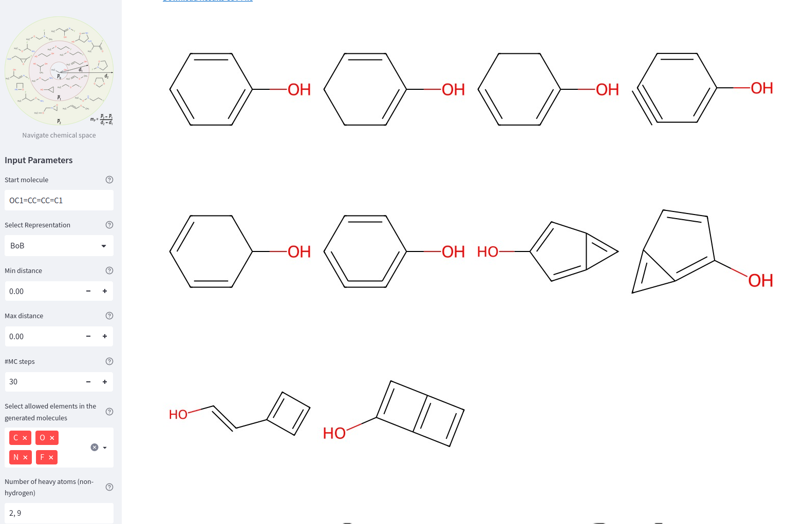

# ChemSpaceSampler: A Chemical Space Sampling App 🧪🚀



Welcome to ChemSpaceSampler, an app for generating novel chemical structures starting from a given molecule.

## Get Started 🏁

To start using the app, please follow the below instructions:

1. **Navigate to the directory**
```bash
cd mosaics/examples/05_chemspacesampler/app
```

2. **Build the Docker image**
```bash
docker build -f Dockerfile -t chemspace ../../..
```
NOTE: For some linux systems if docker was not set up with sudo rights you need to do this command first:
```sudo chmod 666 /var/run/docker.sock```

⏰ Setting up the docker image will take about 5 minutes.

3. **Run the Docker container**
```bash
docker run -p 8501:8501 chemspace
```

4. **Open the app**
Open your web browser and navigate to http://0.0.0.0:8501/.
You're now all set to start experimenting with the ChemSpaceSampler!

## Using the App 🎛

Inside the ChemSpaceSampler app, you can input the parameters and run the ChemSpace Sampler function. Here's what each input means:

- **Start molecule**: This is the starting molecule defined by its SMILES string. SMILES (Simplified Molecular Input Line Entry System) is a way to represent chemical structures in text format.
- **Select Descriptor**: The descriptor is used to calculate the distance between molecules. The options include RDKit, ECFP4, BoB, and SOAP.
- **Minimal distance & Maximal distance**: These parameters define the desired distance range from the start molecule.
- **#MC iterations**: The number of Monte Carlo iterations to be performed.
- **Allowed elements in the generated molecules**: Select the elements that can be included in the generated molecules.
- **Number of heavy atoms**: Define the range for the number of heavy atoms (non-hydrogen) in the generated molecules.
- **Synthesizability cutoff**: Set the soft and hard synthesizability cutoff. The lower the value, the easier the molecule is to synthesize.
- **Only return molecules strictly in the interval**: A filter for post-processing. During the Monte Carlo process, you can accept molecules outside of the target interval if the temperature allows.
- **MMFF94 parameters exist**: Check if the generated molecules should have MMFF94 parameters. This is a sanity check.
- **Ensemble representation**: Check if the ensemble representation should be used. It affects only geometry-based representations (BoB & SOAP).
- **Enter forbidden bonds**: Define any bond types that should not appear in the generated molecules.

Once the parameters are set, you can click on "Run ChemSpace Sampler" to start the molecule generation process!

## Troubleshooting 🚨

If no molecules are found, you might need to adjust your parameters. Try increasing the minimal distance or the number of iterations. If you encounter any errors, double-check your input parameters. Ensure that your starting molecule is consistent with your conditions (i.e., the number of heavy atoms, elements, etc.). If things fail for no apparent reason, don't panic – simply try again.

## Contact and Feedback 📬

For any issues or suggestions, feel free to reach out to us. Your feedback is greatly appreciated!

- [Jan Weinreich](mailto:  [jan.weinreich@epfl.ch])

Happy experimenting! 🎉
